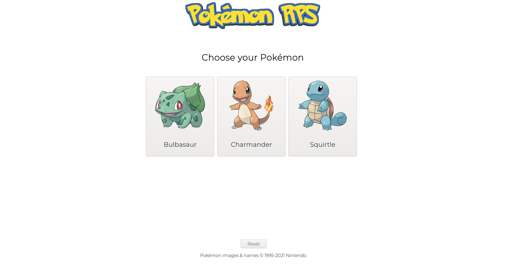

<h1>Rock Paper Scissors</h1>

Project to create Rock Paper Scissors game. Upgraded by changing classic items to Pokémons.

From The Odin Project's <a href="https://www.theodinproject.com/paths/foundations/courses/foundations/lessons/rock-paper-scissors">curriculum.</a>

<h2>Built with</h2>
<h3>Technologies</h3>
  <ul>
    <li>JS</li>
    <li>HTML</li>
    <li>CSS</li>
  </ul> 
<h3>Tools</h3>
  <ul>
    <li>Visual Studio Code</li>
    <li>Linux Terminal</li>
    <li>Git and Github</li>
  </ul> 
<h3>Third party code</h3>
  <ul>
    <li><a href="https://fonts.google.com/">Google Fonts</a></li>
    <li><a href="https://www.npmjs.com/package/canvas-confetti">canvas-confetti</a></li>
  </ul> 
<h2>Home page image</h2>
</img>
<h2>Author</h2>

<a href="https://github.com/Vienio99">Vienio99</a>

